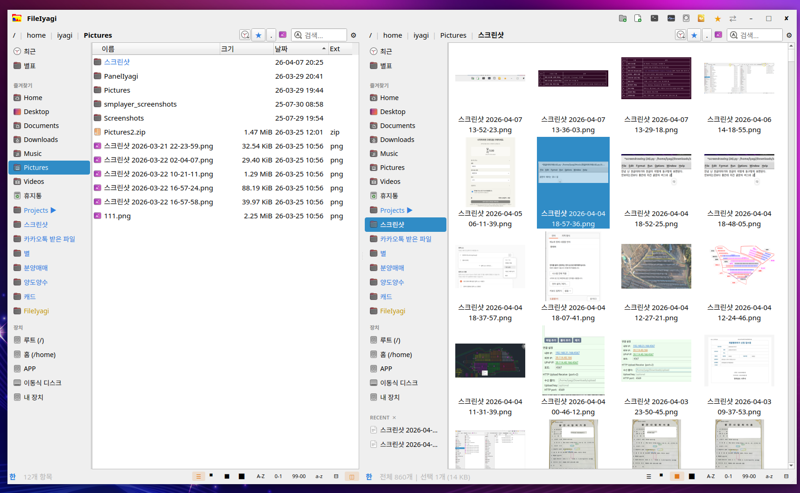

## ⚠️ Notice / 안내

**EN**  
Major feature additions are currently in progress, so you may encounter various bugs.  
However, these issues will be fixed soon in upcoming updates.

**KR**  
현재 대규모 기능 추가가 진행 중이므로, 여러 버그가 발생할 수 있습니다.  
하지만 이러한 문제들은 곧 업데이트를 통해 순차적으로 수정될 예정입니다.

# FileIyagi v1.9.0



A **fast and lightweight file manager** for Windows and Linux.

Designed for speed and responsiveness, FileIyagi ensures **stable text input for Korean file renaming and search**.

It offers high-speed navigation, keyboard-focused workflows, and smooth thumbnail previews.  
The interface automatically adapts to your system language for a natural user experience.

---

## ✨ Features

### Navigation
- **Breadcrumb path bar** — Navigate by clicking path segments
- **Direct path input** — `Ctrl+L` to edit, supports `~` (home directory)
- **Copy path** — Click current folder block to copy full path
- **Forward / Back** — Mouse buttons 4/5 or toolbar arrows
- **Favorites sidebar** — Home, Desktop, Documents + user bookmarks
- **Devices section** — Auto-detect drives and USB (Windows & Linux)
- **Auto mount detection (Linux)** — Sidebar updates on USB connect/disconnect
- **My Devices** — View unmounted drives and mount instantly
- **Recent files (RECENT)** — Per-folder recent file tracking
- **Path history** — Last 15 visited paths (persistent after restart)

### Dual Pane (Two-Panel Mode)
- **Toggle dual pane** — Status bar ◫ button
- **Restore last paths** — Each pane remembers last location
- **Session persistence** — Dual mode state is preserved after restart

### View
- **Details view** — Name, Size, Type, Date (sortable columns)
- **Icon view** — Small (96px), Medium (150px), Large (224px)
- **Thumbnails** — Images + videos (`ffmpegthumbnailer`)
- **Per-folder view memory**
- **Hidden files toggle** — `Ctrl+H`
- **Font resize** — `Alt + Mouse Wheel` (7–24pt)
- **View switching** — `Ctrl + Wheel` or `Ctrl+1~4`
- **Quick sorting** — Status bar buttons
- **Fixed column layout** — Name expands, others fixed

### Search
- **Always-visible search bar**
- **Recursive search** — Includes all subfolders
- **300ms debounce**
- **Open files during search**
- **Drag search results**
- **Optimized layout** — Name & Path share space

### File Operations
- **Copy (F7)** — With sidebar-based destination dialog
- **Move (F6)**
- **Delete (Del / Shift+Del)**
- **Rename (F2)** — Name-only selection (excluding extension)
- **Batch rename (F10)** — Prefix, suffix, replace, numbering
- **New folder (Ctrl+N)**
- **Undo (Ctrl+Z)** — Up to 20 steps
- **New file creation**
- **Cut / Copy / Paste** — Visual feedback included
- **Open with** — MIME-based + recommended apps
- **File viewer (F3)** — Read-only (text/images)
- **File editor (F4)** — Built-in text editor
- **File compare (Ctrl+D)** — A / B / Diff tabs
- **Quick preview (F11)** — Slide-in panel
- **Open terminal (F9)**
- **Folder sync + backup (F8)** — One-way / two-way (dual pane only)
- **Drag & drop**
  - Default: Move  
  - Alt: Copy  
  - Shift: Duplicate (auto rename)  
  - Right-drag: Context menu
- **Properties** — Includes recursive file count
- **Compression** — zip, tar.gz, tar.bz2, tar.xz
- **Extract** — Auto folder creation on open

### Custom Toolbar Buttons
- 3 customizable buttons in title bar
- Right-click to configure name, command, icon
- Auto-load icons from `.desktop`
- App picker (system + Snap + Flatpak)
- `%f` argument support for selected file

### System
- **Window size/position persistence**
- **Favorites saved in OS config path**
- **Real-time file monitoring (Linux, inotify)**
- **44-language UI auto-detection**

---

## 🚀 Highlights

| | |
|---|---|
| ◫ **Dual Pane** | Toggle with status bar button |
| ⇄ **Sync + Backup** | One-way / two-way sync (F8) |
| 🖼 **Thumbnails** | Image & video preview |
| 🔍 **Fast Search** | Recursive + real-time |
| ⌨ **Perfect Korean IME Support** | Stable input (Qt6 native) |
| 📁 **Per-folder View Memory** | Remembers last mode |
| ✂ **Clipboard Operations** | Full cut/copy/paste |
| ↩ **Undo (Ctrl+Z)** | Up to 20 steps |
| 📝 **Batch Rename** | Powerful rename tool |
| 🖱 **Mouse Navigation** | Back/forward buttons |
| 💾 **Window Restore** | Auto save/restore |
| 🌐 **44 Languages** | Auto UI translation |
| 🗜 **Archive Support** | Compress & extract |
| 💿 **Device Manager** | Mount drives easily |
| 📂 **Recent Files** | Per-folder tracking |
| ⚡ **Fast Loading** | Faster than Nautilus |
| 🔧 **Custom Toolbar** | Command + icon support |
| 🕑 **Path History** | Persistent (15 entries) |
| ❓ **Shortcut Help** | Press F1 |

---

## 🎮 Shortcuts

| Key | Action |
|---|---|
| F1 | Help |
| F2 | Rename |
| F3 | Viewer |
| F4 | Editor |
| F5 | Refresh |
| F6 | Move |
| F7 | Copy |
| F8 | Sync + Backup |
| F9 | Open Terminal |
| F10 | Batch Rename |
| F11 | Quick Preview |
| Del | Delete |
| Shift+Del | Force Delete |
| Backspace | Up Folder |
| Enter | Open |
| Ctrl+L | Path Input |
| Ctrl+H | Hidden Files |
| Ctrl+F | Focus Search |
| Ctrl+N | New Folder |
| Ctrl+Z | Undo |
| Ctrl+D | Compare |
| Ctrl+X/C/V | Cut/Copy/Paste |
| Ctrl+1~4 | View Modes |
| Ctrl+Wheel | Cycle Views |
| Alt+Wheel | Font Size |
| Alt+Drag | Copy |
| Alt+1~9 | Bookmarks |
| Mouse 4/5 | Back / Forward |
| Esc | Clear Search |

---

## 🖧 Thumbnails

To enable video thumbnails:

```bash
sudo apt install ffmpegthumbnailer
```

---

## 🖥 Platforms

- Windows 10 / 11 (MinGW or MSVC, Qt 6.4+)
- Ubuntu 22.04 / 24.04+ (Wayland / X11, Qt 6.4+)

---

## 👤 Developer

IYAGI INC  
Email: iyagicom@gmail.com  
GitHub: https://github.com/iyagicom  

---

## 📜 License

Copyright (c) 2026 IYAGI INC. All rights reserved.

This software is distributed in **binary form only**. Source code is not 공개.

### Linux Version
Free to use, install, package, and redistribute for all purposes  
(personal, commercial, educational, government, etc.)

### Windows Version
Distributed via Microsoft Store.  
Usage and licensing are managed by the Store.
