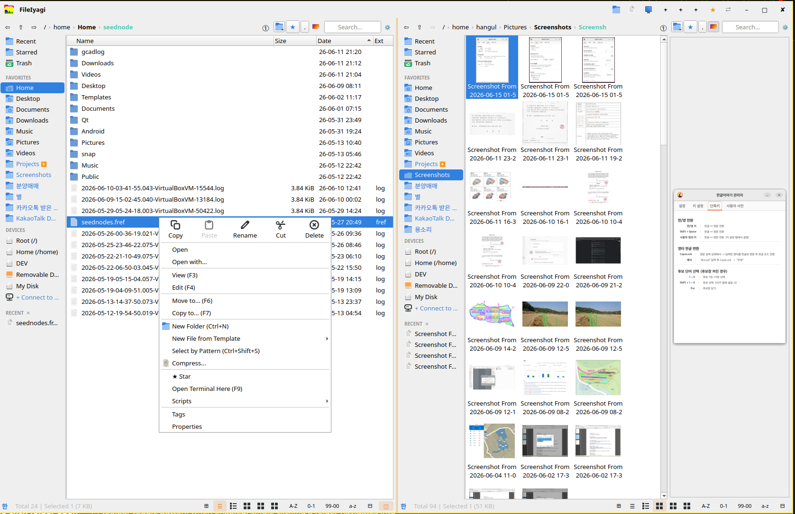

# FileIyagi v1.0.0




⚡ A **fast, clean and lightweight** file manager for Windows and Linux.

Built with Qt6 to solve the Korean IME input problems found in Nautilus and other GTK file managers — renaming files and searching both work correctly in any language. The UI automatically switches between Korean and English based on the system locale.

---

## ✨ Features

### Navigation
* **Breadcrumb path bar** — clickable path segments for quick parent folder navigation
* **Direct path input** — toggle edit mode with `Ctrl+L`, supports `~` for home directory
* **Copy path** — click the current folder segment to copy the full path to clipboard
* **Back / Forward** — mouse buttons 4 & 5, or toolbar ←→ buttons with full history stack
* **Favorites sidebar** — standard folders + user bookmarks
* **Device section** — auto-detected drives and USB volumes with volume labels (Windows & Linux)
* **Auto mount detection** (Linux) — sidebar refreshes when USB is plugged or unplugged

### View Modes
* **Details view** — name, size, date columns with directory-first sorting
* **Icon view** — three sizes: small (64px), medium (96px), large (128px)
* **Thumbnails** — auto-generated for images (Qt) and videos (`ffmpegthumbnailer`), XDG/platform cache
* **Per-folder view mode** — each folder remembers its last view mode
* **Hidden file toggle** — `Ctrl+H` or the "." button
* **Font size** — adjust live with `Alt+Wheel` (7–24pt)
* **View mode cycling** — `Ctrl+Wheel` or `Ctrl+1–4`

### Search
* **Always-visible search bar** — active at all times on the right side of the toolbar
* **Recursive search** — searches all subdirectories under the current folder
* **300 ms debounce** — starts after a short pause in typing
* **Search-preserving file open** — opening a file from results keeps the search active
* **Drag from search results** — drag files to other apps directly from search results

### File Operations
* **Copy (F5)** — select destination via dialog
* **Move (F6)** — select destination via dialog
* **Delete (Del)** — with confirmation dialog
* **Rename (F2)** — inline editing, name pre-selected without extension
* **New folder (F7)** — works from anywhere, including sidebar focus
* **Drag & drop** — drag files to other apps (image viewers, GIMP, etc.)
* **Properties** — name, path, size, and modification date

### System
* **Window size/position saved** — restored on next launch
* **Bookmark persistence** — saved to OS-appropriate config path (Windows: %APPDATA%, Linux: ~/.config)
* **Real-time file detection** (Linux) — inotify-based, new files appear instantly
* **Auto language** — Korean UI if system locale is Korean, English otherwise


### Key Features

|                                     |                                                                          |
| ----------------------------------- | ------------------------------------------------------------------------ |
| 🖼 **Thumbnail Preview**            | Automatic image and video thumbnails using XDG cache                     |
| 🔍 **Fast Search**                  | Recursive subfolder search with always-visible search bar                |
| ⌨ **Full Korean IME Support**       | Native Qt6 input — works correctly in rename and search                  |
| 📁 **Per-Folder View Mode**         | Each folder remembers its last view setting                              |
| 🖱 **Mouse Back / Forward Buttons** | Natural history navigation                                               |
| 💾 **Auto Window State Save**       | Window size and position restored on next launch                         |
| 🌐 **Auto Language Switching**      | UI language follows system language (Korean / English)                   |
| 🗜 **Archive Compress / Extract**   | Double-click to extract zip / tar.gz / 7z / rar, compress selected files |
| ⚡ **Fast Loading**                  | Faster startup and browsing than Nautilus                                |
| 🖥 **Default File Manager Support** | xdg-mime integration and file-manager mouse key support                  |


## 🎮 Keyboard Shortcuts

| Key | Action |
|---|---|
| F2 | Rename (selects name only, not extension) |
| F5 | Copy |
| F6 | Move |
| F7 | New folder |
| Del | Delete |
| Backspace | Go to parent folder |
| Enter | Open / navigate into folder |
| Ctrl+L | Toggle path edit mode |
| Ctrl+H | Toggle hidden files |
| Ctrl+F | Focus search bar |
| Ctrl+R | Refresh |
| Ctrl+1 | Details view |
| Ctrl+2 | Icon view (small) |
| Ctrl+3 | Icon view (medium) |
| Ctrl+4 | Icon view (large) |
| Ctrl+Wheel | Cycle view modes |
| Alt+Wheel | Adjust font size |
| Mouse Button 4 | Back |
| Mouse Button 5 | Forward |
| Esc | Clear search |

---

## 🖧 Thumbnail Setup

For video thumbnails, install `ffmpegthumbnailer`:

```bash
# Linux
sudo apt install ffmpegthumbnailer
```
---

## 🖥 Supported Platforms

* Windows 10 / 11 (MinGW or MSVC, Qt 6.4+)
* Ubuntu 22.04 / 24.04 or later (GNOME Wayland / X11, Qt 6.4+)

---

## 👤 Author

IYAGI INC
Email: [iyagicom@gmail.com](mailto:iyagicom@gmail.com)
GitHub: https://github.com/iyagicom

---

## 📜 License

Copyright (c) 2026 IYAGI INC. All rights reserved.

This software is provided as **executable files only**. Source code is not publicly available.

You may use this software for personal and non-commercial purposes.
Redistribution, modification, or reverse engineering is prohibited without explicit written permission from the author.
